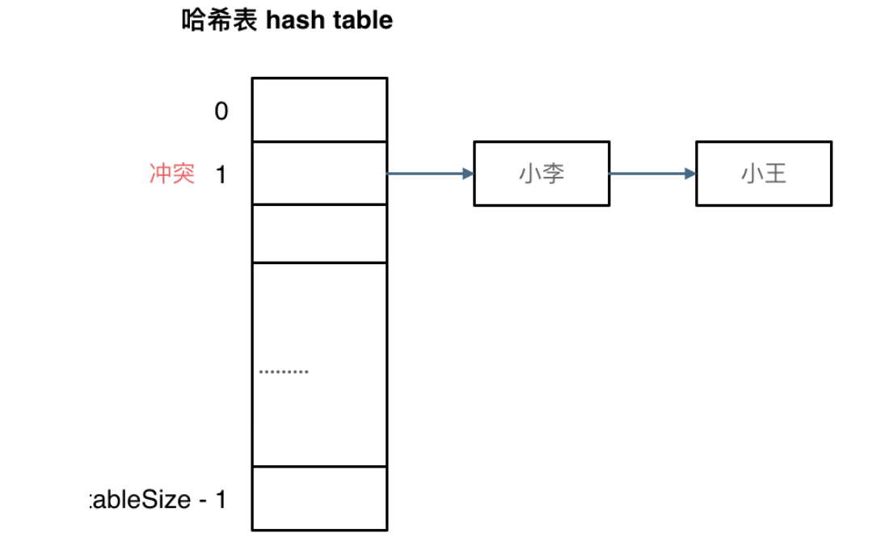

哈希表(hash table也译作散列表)。 
~~~
哈希表是根据关键码的值而直接进行访问的数据结构。
~~~
直白来讲，数组，字典之类的就是哈希表。 一般哈希表都是用来快速判断一个元素是否出现集合里。 
### 哈希碰撞
**拉链法** 

引入链表辅助 
**线性探测法** 
使用线性探测法，一定要保证tableSize大于dataSize。 我们需要依靠哈希表中的空位来解决碰撞问题。 

### 饼干
总结一下，当我们遇到了要快速判断一个元素是否出现集合里的时候，就要考虑哈希法。 
但是哈希法也是牺牲了空间换取了时间，因为我们要使用额外的数组，set或者是map来存放数据，才能实现快速的查找。 
具体情况要通过实例来理解